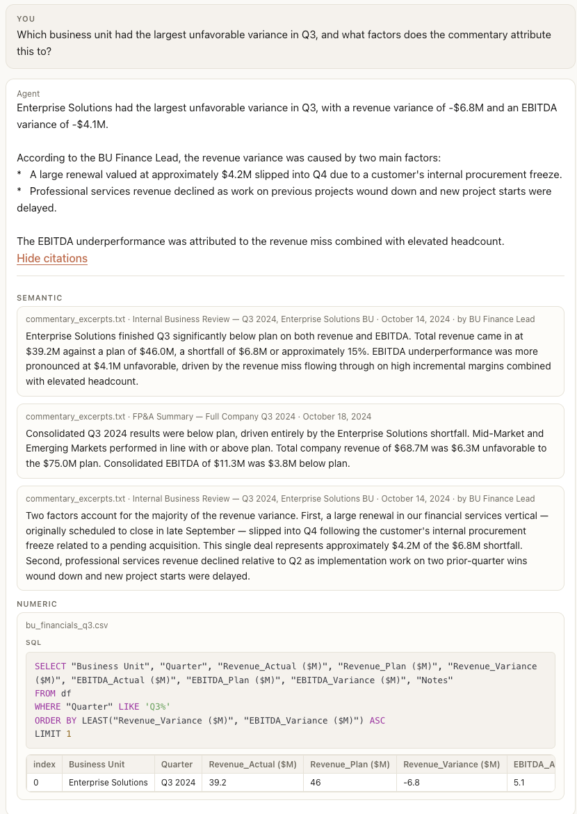

# Finance Agent — RAG over mixed financial data

A retrieval-augmented QA system over structured quarterly financials
(CSV/XLSX) and unstructured commentary (earnings-call-style transcripts,
BU review memos). It answers variance questions with grounded citations,
and refuses rather than fabricates when the evidence does not support an
answer.

## Quick start

Requires Python 3.10+ and a Gemini API key.

```bash
python -m venv .venv
source .venv/bin/activate
pip install -r requirements.txt
echo "GOOGLE_API_KEY=<your-gemini-key>" > .env
uvicorn app:app --reload
```

Open <http://localhost:8000>, upload `bu_financials_q3.csv` and
`commentary_excerpts.txt`, and ask a question — e.g. *"Which business
unit had the largest unfavorable variance in Q3, and what factors does
the commentary attribute this to?"*

## Repository layout

| Path | Purpose |
|------|---------|
| [Ingestion/process.py](Ingestion/process.py) | File ingestion → `DataObject` (tabular → `DataFrame`, text → single-row frame). |
| [Chunking/chunking.py](Chunking/chunking.py) | Metadata-aware splitter for commentary; lazily embeds chunks via Gemini. |
| [Retrieval/retriever.py](Retrieval/retriever.py) | FAISS dense retrieval + LLM reranker, plus LLM-generated DuckDB SQL over tables. |
| [Agent/agent.py](Agent/agent.py) | Orchestrates retrieval, builds evidence, calls BAML, returns citations. |
| [baml_src/](baml_src/) | BAML prompts — `AnswerFinancialQuery`, `GenerateSQL`, `RerankChunks`. |
| [app.py](app.py) | FastAPI server: upload, reset, query. |

## How the pipeline works

### Ingestion

Each source becomes a `DataObject` carrying a `DataFrame`, a column
schema, the filename, and its `MimeType`. Text files are stored as a
single-row frame so everything downstream sees the same object model.

### Chunking (unstructured text)

The commentary corpus uses `--- DOCUMENT N ---` markers followed by a
`Source / Date / Author / Participants` header block. The chunker:

1. Splits on document markers so each document keeps its own metadata.
2. Parses the header into structured fields (`title`, `author`,
   `participants`, `date`) stamped on every chunk — this is what lets
   the agent enforce entity attribution later.
3. Splits the body on paragraph boundaries, which are already
   semantically meaningful here (transcript turns, memo points).
4. Keeps exact character offsets so a citation resolves back to the
   source span.

### Embedding

`gemini-embedding-001` for both chunks and user queries. Each chunk is
prefixed with a header (`[title | date | by author]`) before embedding,
so metadata participates in similarity — this helps entity-sensitive
queries like *"what did the BU Finance Lead say?"*

### Retrieval

Two parallel retrievers run on every query:

- **Semantic (unstructured) — dense retrieval + LLM rerank.** FAISS
  `IndexFlatIP` over L2-normalised vectors (inner product == cosine)
  pulls `topk_retrieve=10` candidates, which a Gemini reranker
  (`RerankChunks` in [baml_src/reranker.baml](baml_src/reranker.baml))
  rescores against the query on a strict 0–1 rubric that penalises
  topic-only matches and wrong-entity matches. Only the top
  `topk_final=3` survive. If the rerank call fails, the retriever falls
  back to dense order.
- **Numeric (structured) — LLM-planned SQL.** The query plus every
  table's schema and a 5-row sample go to `GenerateSQL`, which decides
  per-table whether it can answer and emits a DuckDB `SELECT` over a
  relation aliased `df`. Only relevant tables with non-empty results
  become numeric citations.

If both return nothing, the agent short-circuits with a deterministic
`Cannot be answered` without calling the answering LLM
([Agent/agent.py](Agent/agent.py)).

### Grounding / citations

Every response carries structured citations:

- **Semantic**: source file, title/author/participants/date, the literal
  content, rerank score, and character offsets.
- **Numeric**: source filename, the exact DuckDB SQL that ran, and the
  rows it returned.

A reviewer can re-run the SQL or open the source at the cited offsets —
no part of the answer is unattributable.

## Example



## No-fabrication guarantees

Three layers, in order:

1. **Retrieval** — if FAISS+rerank and the SQL planner both return
   nothing, the agent returns `Cannot be answered` without calling the
   answering LLM.
2. **Prompt** — `AnswerFinancialQuery` in
   [baml_src/answer_generation.baml](baml_src/answer_generation.baml)
   requires setting `answerable=false` and answering with `"Cannot be
   answered"` when evidence is insufficient, and forbids mixing
   speakers or inventing numbers, dates, entities, or people.
3. **Schema** — `FinancialAnswer.answerable: bool` lets consumers gate
   programmatically instead of string-matching the refusal.

---

## Part 2 — Hallucination mitigation

**Probe query:** *"What was the CEO's guidance on the Q3 variance and
what remediation steps did she commit to?"*

### Failure modes

This is a honeypot: the corpus contains **no CEO**. Speakers in the Q3
QBR (Document 2) are the CFO, VP Sales, BU Finance Lead, and FP&A;
Documents 1, 3, 4 are authored by BU finance staff; Document 5 is an
unsigned FP&A summary. The question also presupposes remediation
commitments nobody actually makes.

1. **Speaker substitution.** A naive RAG retrieves Document 2 (it's the
   most topically similar chunk) and blurs "the CFO said X" into "the
   CEO said X". The gendered *she* nudges the model to pick any senior
   speaker and map them onto the pronoun.
2. **Commitment fabrication.** The CFO asks FP&A to reflect the FSI
   deal and flag services risk in the Q4 bridge — an internal ask, not
   a public remediation commitment. A loose prompt paraphrases this as
   "she committed to X, Y, Z," inventing structure that isn't there.

### Mitigations implemented

- **Prompt-level entity attribution** in
  [baml_src/answer_generation.baml](baml_src/answer_generation.baml):
  another speaker's words cannot be substituted for the requested
  entity's, and if the entity isn't in the evidence the answer must be
  `Cannot be answered`.
- **Structured `answerable: bool`** so consumers don't string-match
  refusals.
- **Empty-evidence short-circuit** in the agent.
- **LLM reranker with an entity-aware rubric** in
  [baml_src/reranker.baml](baml_src/reranker.baml): the reranker is
  told to score chunks low when the question asks about person X and
  the chunk is by or about someone else, even if the topic matches.
  This directly attacks the "most topically similar chunk wins" failure
  that enables speaker substitution in the first place.

### Tradeoffs

**What this catches.** The CEO isn't a participant or author anywhere,
so the reranker pushes Document 2 down (wrong entity) and the answer
prompt refuses cleanly. Commitment fabrication is caught because the
prompt forbids inventing concrete facts and there are no CEO-authored
commitments to quote.

**What it still misses.**

- Prompt-only mitigations are probabilistic. Adversarial phrasing like
  *"summarise leadership's view on Q3"* can still regress, because
  *leadership* is fuzzy enough to license quoting the CFO.
- The reranker adds one extra LLM call per query (~latency and cost)
  and is itself an LLM — it can mis-score, and a hard failure falls
  back to dense order. Cutting `topk_final` to 3 also means a genuinely
  relevant chunk in ranks 4–10 is now dropped; the bet is that
  precision matters more than recall in a financial setting.
- The inverse failure — a real entity *is* present but the retriever
  fails to surface their chunk in top-k — still produces false-negative
  refusals. A deterministic entity-presence pre-check against chunk
  metadata (`author` / `participants`) before calling the LLM would
  close this gap but adds a role-normalisation problem (is "Chief
  Executive" the CEO?). For this corpus, the current layering is the
  right cost/benefit point; at scale I would add the metadata
  pre-check.
